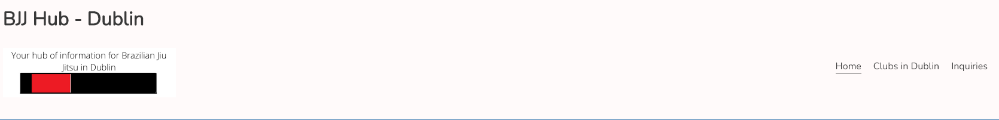
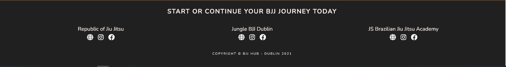
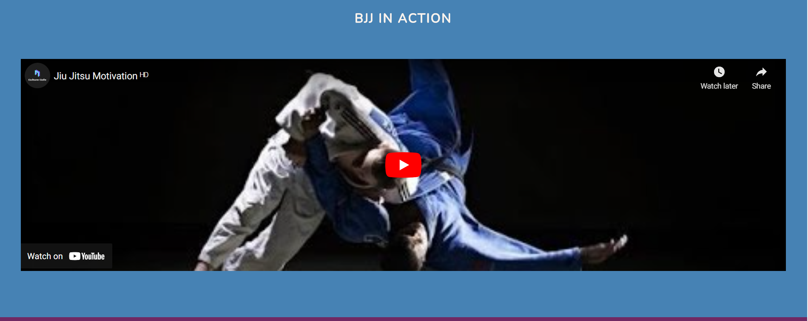
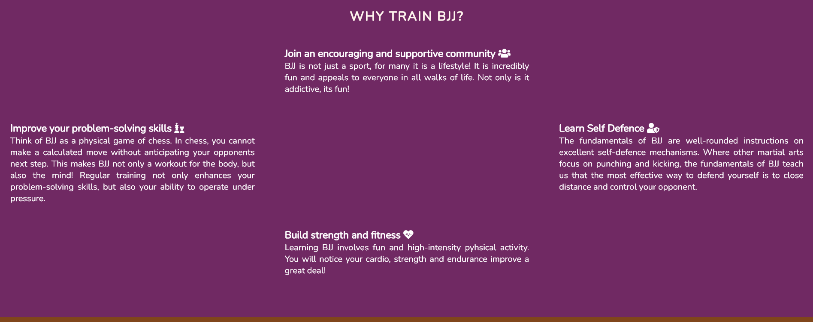
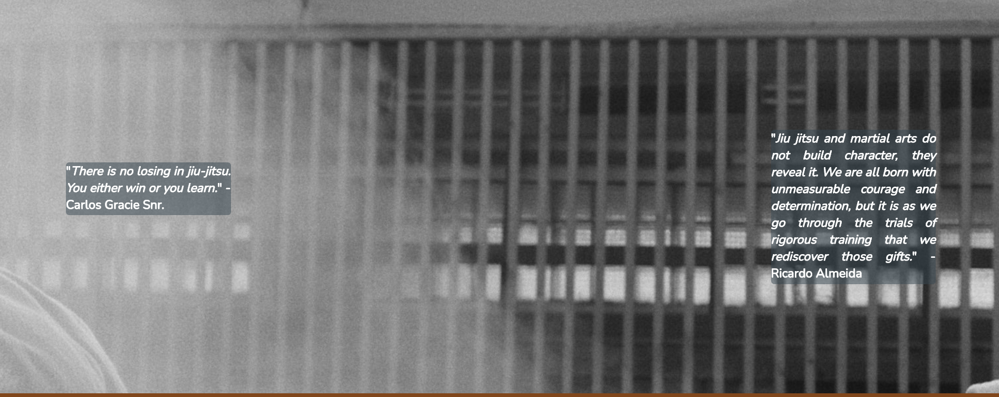
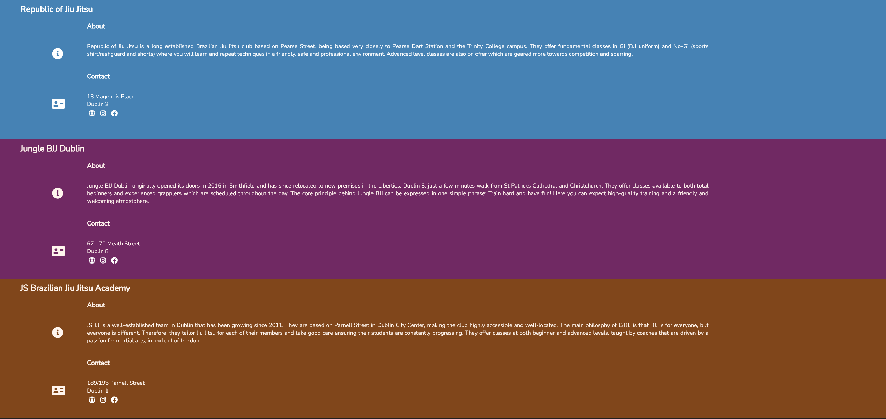
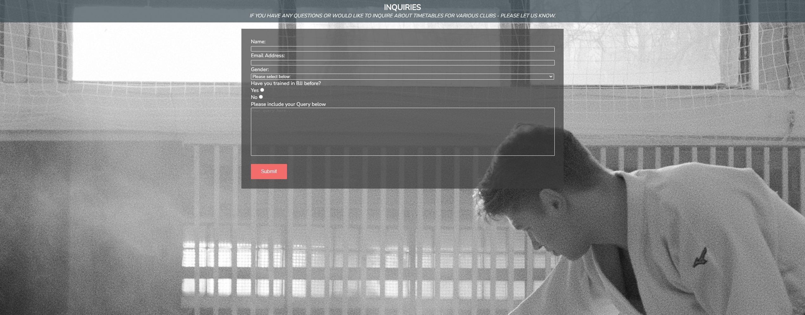
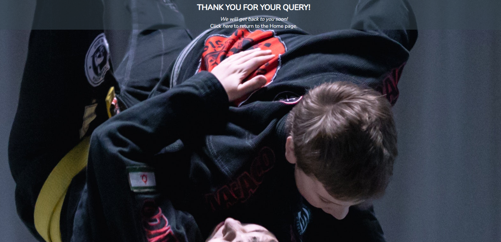

# BJJ Hub - Dublin

## Project Overview

The aim of this project is to be used as a hub of information on Brazilian jiu jitsu clubs based in Dublin city centre. As the project includes information on clubs based in Dublin along with their address and links to social media, it is also intended to be used by people who have trained elsewhere before and have recently moved to Dublin and are looking for nearby gyms where they can train.

For future updates to the project, I would like to include a news section that includes up to date information on clubs based in Dublin and upcoming competitions. I would also like to include a news section that relates to the global BJJ community, to include upcoming matches with popular grapplers and also sales on instructional videos online. I would also like to include a section including articles written by the wider BJJ community on subjects such as conditioning and nutrition.

## User Experience (UX)

### User Stories

1. First Time User Goals
    * As a first time user, I want to easily understand the main purpose of the site and learn more about BJJ as a hobby.
    * As a first time user, I want the site to be intuitive and user friendly so I can easily navigate the site and obtain the information I need easily.
    * As a first time user, I want information on BJJ clubs in Dublin. A brief note on the club itself along with their address and links to their social media so I can make an informed decision as to what club I would like to join. 

2.  Returning User Goals
    * As a returning user, I would like to see information on new clubs opened in Dublin.
    * As a returning user, I would like to have a platform where I can ask questions regarding clubs to better inform my decision.
    * As a returning user, I would like the up to date information on clubs. For example if a club has changed location.

3. Frequent User Goals
    * As a frequent user, I want to receive up to date news on any seminars, upcoming competitions or open mats taking place in Dublin.
    * As a frequent user, I want to be able to read articles written by the wider BJJ community on subjects such as conditioning and nutrition.
    * As a frequent user, I want to receive up to date news on the wider, global BJJ community. For example, upcoming matches of interest I can watch online or, sales on instructional videos online.

### Design

1. Colour Scheme
    * The colour scheme on the home and clubs in Dublin pages represent the five belt levels in Brazilian Jiu Jitsu; white, blue, purple, brown, black. It starts at white in the header, then sections in the order of blue, purple and brown with the footer being black.

2. Typography
    * The Roboto-Condensed family is used in the header text and section titles with Nunito being used in the individual section content. Sans-serif is set as the fallback font in every case in case the other fonts cannot be imported correctly. Roboto-Condensed and Nunito are used as they are clean, sleek and modern looking.

3.  Imagery
    * Various images of the inside of a BJJ gym are used as hero images on the home page and inquiries page. As the video used at the top of the home page shows BJJ in action and rather intensely at that, I felt that some calmer images that were still relevant would be more appropriate and welcoming for users. A background image of BJJ practitioners demonstrating a throw is used on the "thank you for your query" page which is intended as a show of what is in store for users interested in practicing the sport.

4. Video
    * A video embedded from YouTube displaying a diverse range of BJJ practitioners competing. The song playing over the video is "Don't Let Me Down" by The Chainsmokers feat. Daya. The reason behind this video being included is to function as a sort of "highlight reel" to show people what they will be learning should they begin training themselves
    
### Wireframes

#### Desktop

1. Please find the desktop version wireframe for the home page [here.](assets/wireframes/desktop/home.png)
2. Please find the desktop version wireframe for the  clubs in dublin page [here.](assets/wireframes/desktop/clubs.png)
3. Please find the desktop version wireframe for the inquiries page [here.](assets/wireframes/desktop/inquiries.png)
4. Please find the desktop version wireframe for the  thank you page [here.](assets/wireframes/desktop/thanks.png)

#### Mobile

1. Please find the mobile version wireframe for the  home page [here.](assets/wireframes/mobile/home-mobile.png)
2. Please find the mobile version wireframe for the mobile clubs in dublin page [here.](assets/wireframes/mobile/clubs-mobile.png)
3. Please find the mobile version wireframe for the inquiries page [here.](assets/wireframes/mobile/inquiries-mobile.png)
4. Please find the mobile version wireframe for the  thank you page [here.](assets/wireframes/mobile/thanks-mobile.png)

### Coding Languages Used

1. HTML5
2. CSS3

### Features

The project is responsive on all screen sizes and includes interactive elements.

### Navigation Bar and Header

The navigation bar is featured on all pages, is fully functional and includes CSS code which underlines which page the user is currently on. On the left hand side of the screen is the site title and logo. The title also functions as a clickable link to return the user to the home page. The nav bar and accompanying elements in the header are fully responsive also.

### Footer

The footer's purpose is to serve as a quick way for users to access the online presence of the clubs referred to on the site. There are 3 clubs named in the footer and each one has a working link to their website, Facebook and Instagram pages. 

### Home Page 

1. BJJ in action. The first thing a user will see when they click into the site is an exciting video which shows many of the top BJJ competitors in tournaments. The purpose of this video and its placement is to entice the user to play the video and then be compelled to view what else is on offer on both the site and in practicing BJJ.

2. Why train BJJ. This is a small section following the video which is intended to steer the user more towards the sites purpose, to train BJJ! The benefits listed are physical, mental and social.

3. Hero section with quotes. Following the benefits, we have a hero image which is a close up picture of the inside of a BJJ dojo with 2 motivational quotes from world renowned BJJ practitioners. The thinking behind the image itself is to be more calm and than the intense video above and is a reference to BJJ also being known as the "gentle art".

### Clubs in Dublin 

The clubs in Dublin page is essentially the core of the project. The home page is intended to motivate people to train in BJJ and the clubs page tells them where they can do so. There are 3 clubs detailed here and each segment has the clubs name, address, a brief paragraph on their ethos and again, links to their website and social media. 

### Inquiries

The inquiries page consists of a query form and a background image of the inside of a BJJ club. The query form is designed so that users can forward queries to the site administrator that relate to the clubs in Dublin or even queries on training on BJJ in general. As this project consists of front-end languages only (HTML and CSS) there is currently no back-end functionality to the form. There is however, a brief page thanking the user for their query.

### Thank You

When a user submits the above inquiries form, they are greeted with a background image of 2 BJJ practitioners demonstrating a throw and also with a message thanking them for their query. There is also a clickable link in the text to return the user to the homepage. 

All of the above are fully responsive on all devices.

## Testing

### Validator Testing
1. HTML - No errors were returned on any of the project pages when passing through the official [W3C Markup Validator](https://validator.w3.org/).
2. CSS - No errors found when passing through the official [W3C Jigsaw Validator](https://jigsaw.w3.org/css-validator/).

### Responsive Design

The project has been tested through [Am I responsive](http://ami.responsivedesign.is/) and is responsive on all devices.

### Future Enhancements

- It had originally been intended that a "history of bjj" page would be included on the site. However, as this page was comprised of just one large block of text, I felt that this was somewhat disruptive to the flow of the project and also less relevant to the purpose of the site as compared to other pages. In future updates, I would like to re-introduce the page to the site, albeit with the text displayed in a way that flows better and is easier digested by users.

- In future updates, I would like to include a page that includes links to articles written by BJJ practitioners that touch on subjects relating to conditioning, techniques and nutrition relevant to BJJ training.

- In future updates, I would like to keep the clubs in Dublin page up to date with all clubs in Dublin and further update the site with new clubs as they open up.

- In futuer updates, I would like to include a type of calendar page that includes dates for important BJJ events in Dublin such as seminars and competitions.

- In future updates, I would like to include a page that includes technique videos such as those found on YouTube that can be viewed and enjoyed by users.

### Bugs and Fixes

- As seen in the "Love Running" CI project - I encountered that issue where my nav elements had their order reversed when i set the items to float right. After some googling, I found that the fix was to float the parent of the listed nav items to the right and then, set the li elements beneath to float to the left. 

- There is a textarea included at the bottom of the form on the inquiries page which I noted that, in the browser, a user could resize the box and expand it beyond the containing div. As the textarea is already given a sufficient size in the HTML code written, I decided to apply the "resize: none" rule in the CSS rule for this element to rectify this.

- While writing the media queries for smaller devices, I was having an issue where a lot of white space was appearing beneath the footer. To fix this, I added the overflow: hidden property to my footer to apply only when the screen size is below a certain size.

- While coding the media queries for mobile devices, an issue occurred where the header logo did not center itself like the nav and title elements when I input the relevant code. Using devtools on Chrome, I found that this was due to the width I had set previously. Once I removed the width setting from the class in CSS I found that the logo could then center itself once the screen size goes lower than 480px without sacrificing it's position on other screen sizes.

- Originally, the home page hero image with quotes had been at the top of the homepage. However, I felt that it would be more enticing to users to find a playable video at the top of the homescreen instead so I switch their positions on the home page.

- In the "why train BJJ" section of the home page, the heading does not appear in the top-center when displaying on larger screens. I was unable to fix this while also maintaining the desired layout of the section content, this will have to be fixed in a future update.

### Credit

#### Code used

- Credit to [sitepoint](https://www.sitepoint.com/community/t/navigation-bar-tabs-displaying-backwards/7904/4) where I found the fix to the issue I had regarding the styled navigation elements appearing in reverse order.

- Credit to Code Institute Love Running project for code used in respect of the "active" class underlining the page the user is currently on.

- Credit to my mentor Narender Singh for the code used in styling the "why train BJJ" section.

- Credit to Code Institute Love Running project for code used in respect of hero image and the styling of the text overlapping the hero image.

- Credit to Code Institute Love Running project for code used to style the form elements on the inquiries page.

- Credit to Code Institute Love Running project for nav styling on screens 950px and below.

#### Media

- YouTube video titled [Jiu Jitsu Motivation](https://www.youtube.com/watch?v=LUmgrve1sZc) on home page uploaded by Culture Cafe'. All rights belong to WME-IMG and Viacom - No copyright infringement intended - the video is entermainment purposes only.

- Quotes from renowned BJJ practitioners taken from a website called [Fightersmarket](https://fightersmarket.com/blogs/fighter/top-10-bjj-quotes-of-all-time).

- Quotes regarding the benefits of traning obtained from [O Athletic](https://www.oathletik.com/benefits-of-brazilian-jiu-jitsu/) and [The Guardian](https://www.theguardian.com/lifeandstyle/2019/sep/14/fitness-tips-brazilian-jiujitsu).

- Credit to [Canva](https://www.canva.com/tools/logo-maker-q1/?utm_source=google_sem&utm_medium=cpc&utm_campaign=REV_UK_EN_CanvaPro_Logo_EM&utm_term=REV_UK_EN_CanvaPro_Create+Logo_EM&gclsrc=aw.ds&&gclid=Cj0KCQiAq7COBhC2ARIsANsPATEeQJoN4xeqLm9OEQP9CWOR_wikL-DmAb0Gw58R_b1Jlf2s37o0mJ0aAmL3EALw_wcB) which I used to design the logo shown in the header.

- Credit to [Artem on Pexels](https://www.pexels.com/photo/healthy-man-person-people-6253346/) for the hero image used on the home page.

- Credit to [Artem on Pexels](https://www.pexels.com/photo/healthy-man-person-people-6253300/) for the background image used on the inquiries page.

- Credit to [cottonbro](https://www.pexels.com/photo/boys-practicing-jiu-jitsu-7988956/) for the background image used on the thank you page.

